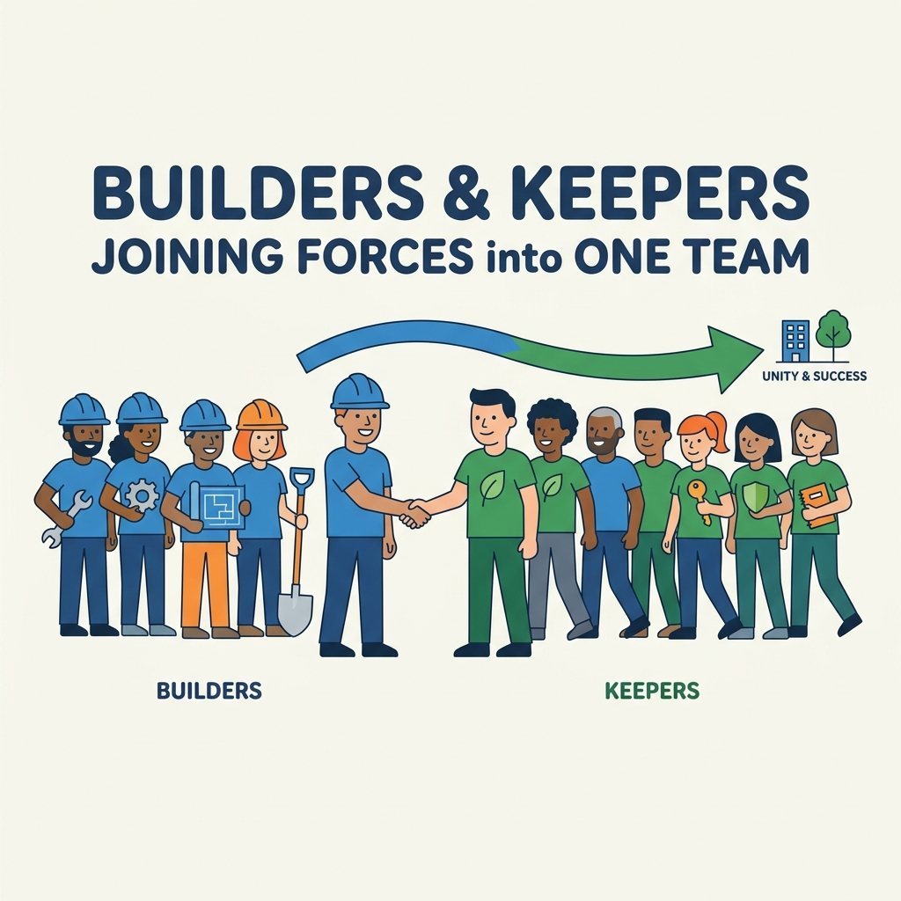
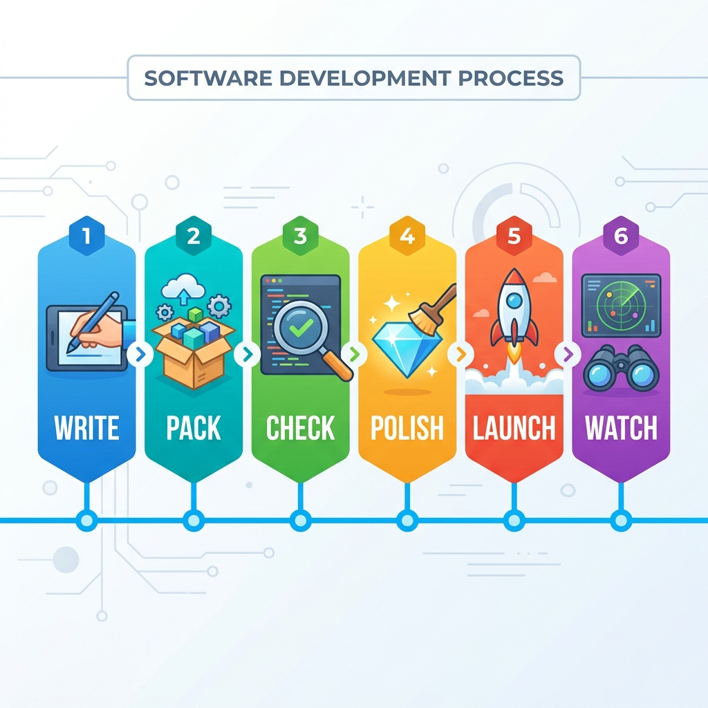
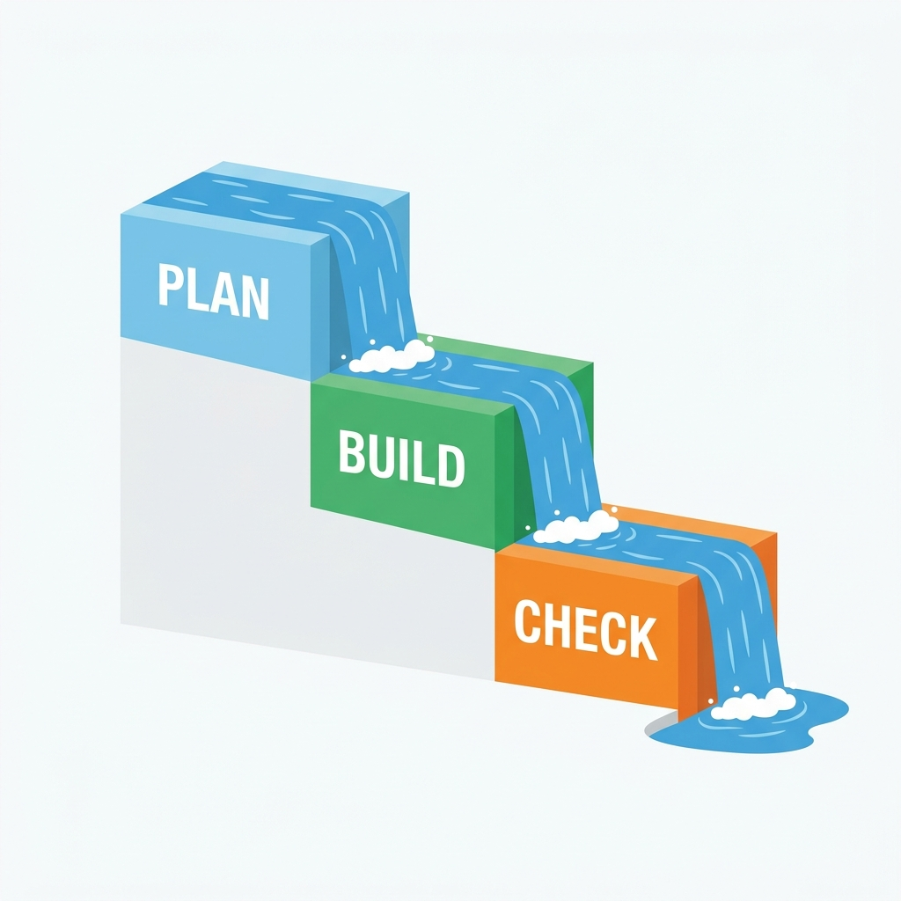
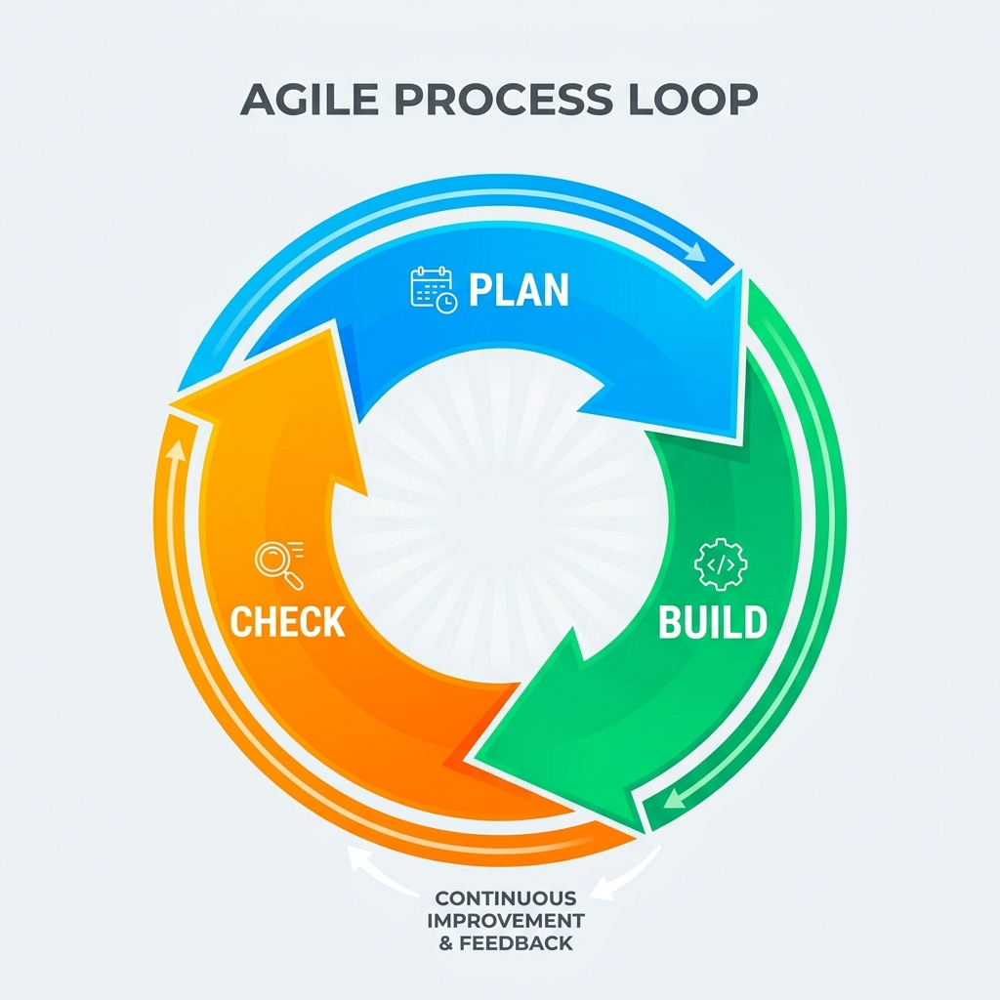

# Making Software: DevOps & the Basics

## What is DevOps?

In the past, making an app was split between two different groups:
1. **The Builders (Dev):** The people who write the code to build the app.
2. **The Keepers (Ops):** The people who make sure the app stays online on the internet.

Because these two groups worked far apart, they often had problems and fixing things took a very long time.

**DevOps** is simply a team-up. It brings the Builders and the Keepers together to work as one single team. This way, the app gets made faster and breaks a lot less often.

## The Steps to Build Software

Building an app is just like building a house. You cannot put on the roof before you build the walls. We follow a clear, simple path.

Here are the clear steps to build any app:

1. **Write:** Typing simple instructions so the computer knows what to make.
2. **Pack:** Boxing up those typed instructions into a real, working app format.
3. **Check:** Making sure all the buttons in the app actually work and don't break.
4. **Polish:** Making sure the app is easy to read and nice for real people to use.
5. **Launch:** Putting the app out on the internet for the world to use.
6. **Watch:** Keeping an eye on the app day and night to fix any problems immediately.

## The Old Way vs. The New Way

How teams work together has changed a lot over the years.

### The Old Way: Waterfall
Think of a waterfall. Water only goes straight down. In the old way, a team finishes one step completely before they can move to the next one. 

**The big problem:** If you make a mistake early on, it is very hard and costs a lot of money to go back "up the waterfall" to fix it.

### The New Way: Agile
Because the old way was too slow and hard, we started using a better way. 

Instead of building the whole app at once, we work in small, fast circles. We build a tiny piece of the app, check it, and then build the next tiny piece. If we make a mistake, it is very easy to go back and fix it without starting over.

## Why is DevOps So Important Today?
The world changes very fast. Today, we expect our phone apps to update instantly with cool new features, quick bug fixes, and security updates. If a company takes months to release an update, users will get bored or frustrated and move to a different app. 

DevOps allows companies to move lightning-fast, fix problems in minutes instead of days, and keep their customers happy. It is the secret ingredient behind how huge companies like Netflix and Amazon update their websites thousands of times a day without you even noticing a blip.

## How AI is Changing DevOps
Artificial Intelligence (AI) is like giving the DevOps team a super-smart robot assistant. Here is how AI is making things even faster:
- **Spotting Problems Early:** AI can watch an app 24/7 and notice when something is acting weird, warning the team *before* the app actually crashes.
- **Writing Code Faster:** AI tools can help the Builders write their instructions much faster by automatically suggesting the next lines of code, almost like predictive text on your phone.
- **Checking for Errors:** AI can act like hundreds of fake users clicking on all the buttons in the app at once to make sure nothing is broken before it launches.

## How to Stay Updated with AI in DevOps
Things with AI move incredibly fast! Here are the easiest ways to keep up without getting confused:
1. **Play with AI:** Try talking to AI tools like ChatGPT or Claude. Ask them simple questions like, "How does the internet work?" or "Help me write a simple code block."
2. **Read the Shorts:** Sign up for quick, bite-sized tech newsletters (like TLDR) that drop short, easy-to-read news right into your email.
3. **Watch YouTube Creators:** There are many friendly creators on YouTube who explain complex new AI tools using very simple language.
4. **Just Try Building Things:** The absolute best way to learn is by doing. Try creating small, fun hobby projects and ask an AI to help you along the way!
