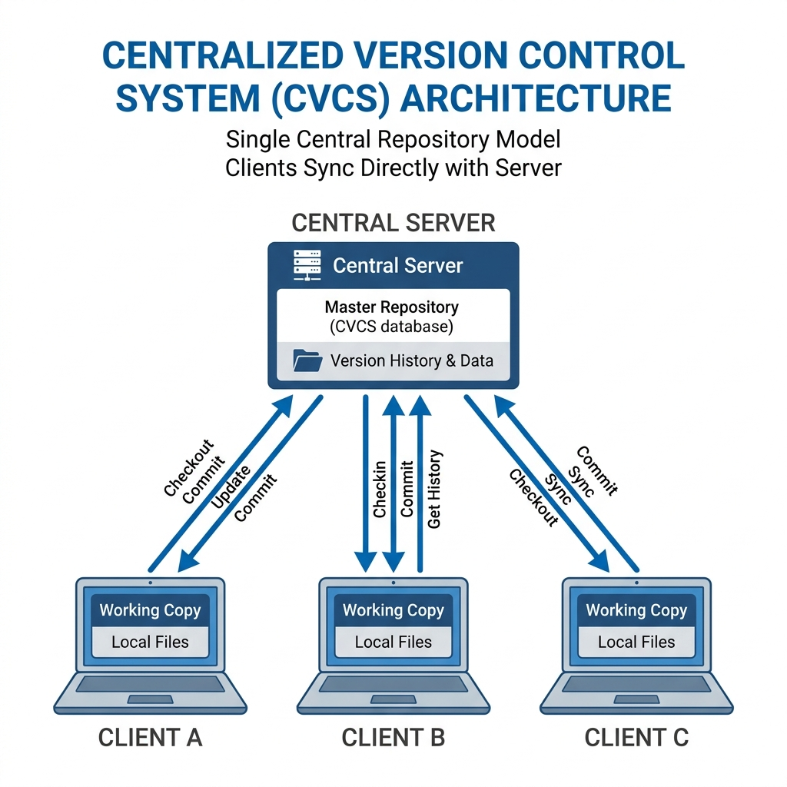
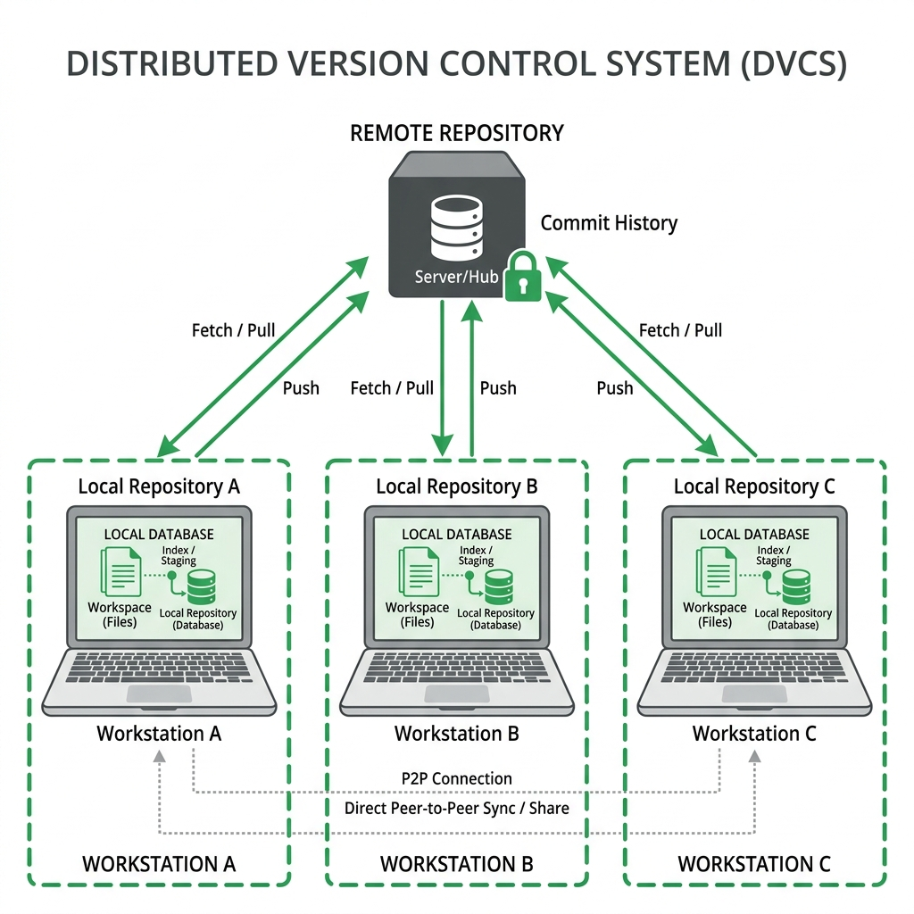

# 🐙 Git & GitHub Essentials

Welcome to the world of Version Control! If you've ever saved a file as `final.doc`, `final-v2.doc`, and `final-v3-really-final.doc`, then you already understand why we need Git.

---

## 🏗️ What is Source Code Management (SCM)?

**SCM** is like a "Time Machine" for your code. It's the process of tracking every single change made to your files. 

### Why do we need it?
*   **Collaboration:** Multiple developers can work on the same project without stepping on each other's toes.
*   **Safety:** If you break something, you can easily "go back in time" to a version that worked.
*   **History:** You can see exactly what changed, when it changed, and who changed it.

---

## 🗄️ CVCS vs. DVCS: The Two Types of Systems

Before Git, most people used Centralized systems. Now, the world has moved to Distributed systems.

### 1. Centralized Version Control (CVCS)
Imagine a single "Master Computer" (Server) that holds all the project files. 

*   **How it works:** To do any work, you must connect to the server, "check out" a file, finish it, and "check in" your work.
*   **Major Downside:** If the server goes down or the internet fails, you can't save your progress. If the server crashes and has no backup, you lose everything!

### 2. Distributed Version Control (DVCS) — *Used by Git*
Instead of one central server, **every single developer** has a full copy of the entire project history on their own computer.

*   **How it works:** You work locally on your machine. You can save (commit) your work offline.
*   **Major Perk:** It’s lightning fast and incredibly safe. Even if the main server is deleted, any developer's computer can be used to restore the entire project.

---

## 📊 Comparison: CVCS vs. DVCS

| Feature | Centralized (CVCS) | Distributed (DVCS / Git) |
| :--- | :--- | :--- |
| **Storage** | One central server holds everything. | Everyone has a full copy of the history. |
| **Internet** | Requires internet to save/update. | Can work offline; internet only needed to share. |
| **Performance** | Slower (always talking to the server). | Super fast (most tasks happen locally). |
| **Risk** | Single point of failure (Server crash = 💀). | Full redundancy (Every PC is a backup). |
| **Examples** | Subversion (SVN), Perforce. | **Git**, Mercurial. |

---

## 🆚 Git vs. GitHub: What's the Difference?

Many people think they are the same thing, but they are very different!

### **Git** (The Tool)
*   **What it is:** The actual software that tracks changes.
*   **Where it lives:** Usually on your local computer.
*   **Analogy:** Think of Git like **Microsoft Word**—it's the tool you use to create and manage your work locally.

### **GitHub** (The Home)
*   **What it is:** A website/cloud service that hosts your Git repositories.
*   **Where it lives:** On the internet (in the cloud).
*   **Analogy:** Think of GitHub like **Google Drive** or **OneDrive**—it's the place where you store and share your Word documents so others can see them.

---

## 💡 Summary
*   **SCM** keeps your code organized.
*   **CVCS** is old-school and risky (server-dependent).
*   **DVCS (Git)** is modern, fast, and safe (full local backups).
*   **Git** is the tool on your PC; **GitHub** is the cloud where you share your work.
