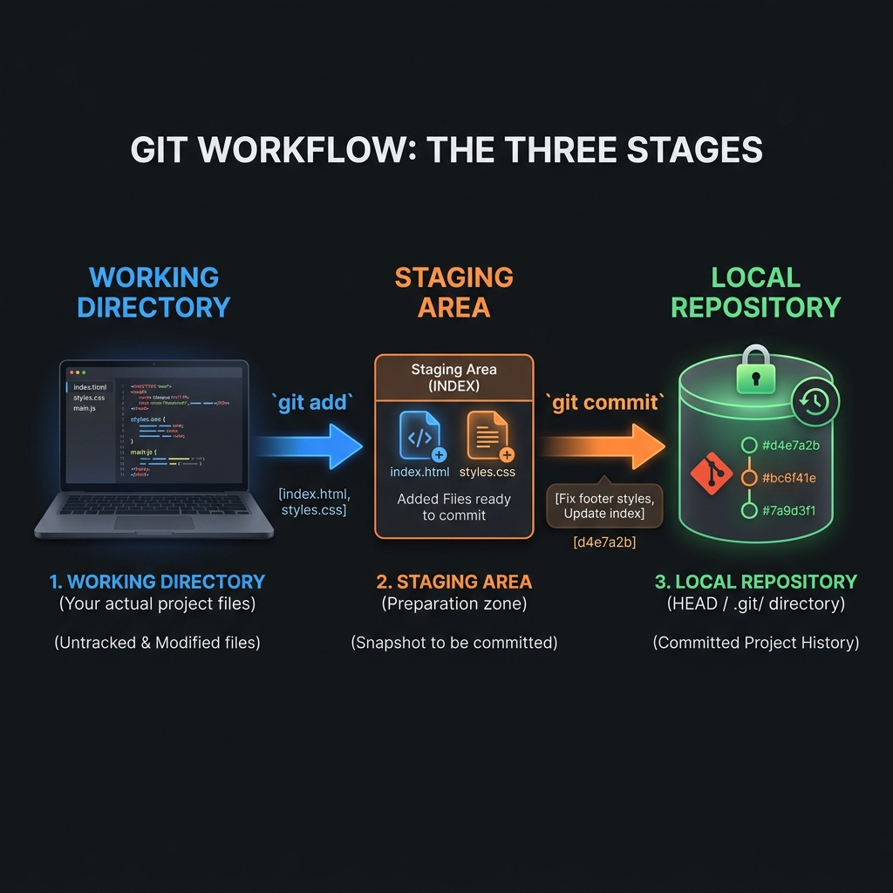

# 🚀 Git Workflow & Core Concepts

In the previous part, we learned the basics. Now, let's take a **deep dive** into how Git actually works under the hood. Understanding these stages is the "secret sauce" to becoming a Git pro!

---

## ⏳ The Evolution: How we got to Git

Before Git was the king of the world, developers tried other ways to save their work.

1.  **Local VCS (The Beginner Way):** You just keep versions on your own computer (e.g., `code_v1`, `code_v2`). 
    *   **The Problem:** If your hard drive crashes, everything is gone! 😱
2.  **Centralized VCS (The Single Point of Failure):** Everyone shares one central server. You must be online to save work.
    *   **The Problem:** If the server is down, nobody can work. If the server dies, the whole project dies. 💀
3.  **Distributed VCS (The Git Way):** **Everyone** has a full copy of the history. 
    *   **The Result:** It's fast, works offline, and is super safe. This is why Git won! 🏆

---

## 🏢 The 3 Stages of Git (The "Studio" Metaphor)

Imagine you are a professional photographer. To get a final photo, you go through three areas:

### 1. Working Directory (The Studio)
This is your actual folder on your computer where you are typing and deleting code. 
*   **State:** Files here are "Untracked" or "Modified". Git knows they changed, but hasn't "saved" them yet.



### 2. Staging Area (The Photo Frame)
This is a middle zone (called the **Index**). You "pick and choose" which changes are ready to be saved.
*   **Why?** Sometimes you change 10 files but only want to save 2 of them right now. You "stage" those 2.

### 3. Local Repository (The Photo Album)
Once you are happy with the staging area, you take a "snapshot." This is now permanently saved in Git's history with a unique **Commit ID** (a long string like `a1b2c3d`).

---

## 🛠️ The Core Workflow Commands

Here is the "Day in the Life" of a developer using Git:

| Command | Action | Where does it go? |
| :--- | :--- | :--- |
| `git add` | **Add** files to the "bucket". | Working Directory ➡️ Staging Area |
| `git commit` | **Save** the "snapshot". | Staging Area ➡️ Local Repo |
| `git push` | **Upload** your work to the cloud. | Local Repo ➡️ GitHub |
| `git pull` | **Download** latest work from others. | GitHub ➡️ Local Machine |

---

## 🌿 Branching: Working in Parallel

Branching is Git’s most powerful feature. It allows you to "split" from the main project to work on something new without breaking the original code.

*   **Main Branch:** The stable, "live" version of your code.
*   **Feature Branch:** Your "playground" where you fix a bug or add a new button.
*   **Merging:** Once your feature is tested and perfect, you "merge" it back into the Main branch.

### 🖼️ Visualizing a Branch
Think of it like a **Tree branch** growing out of a trunk:

```text
       (New Feature)      [Commit] --- [Commit]
                         /                      \
[Main Trunk]  [Commit] --- [Commit] --- [Commit] --- [Merged!]
```

**Example:** 
*   *Developer A* is fixing a bug on a `bug-fix` branch.
*   *Developer B* is adding a dark mode on a `dark-mode` branch.
*   They both work at the same time and merge their work when done. **No collisions!**

---

## ✅ Why is Git so Awesome? (Advantages)

1.  **Free & Open Source:** Anyone can use it for free!
2.  **Lightning Fast:** Since almost everything happens on your own computer (not over the internet), it's nearly instant.
3.  **Incredibly Secure:** Git uses **SHA-1 Hashing**. This means if even a single comma is changed in your code, the "ID" of that version changes. It's impossible to fake or corrupt history.
4.  **No Heavy Server:** You don't need a massive, expensive server to manage versions. Your laptop is powerful enough!

---

## 💡 Quick Summary
*   **Git has 3 areas:** Working Directory ➡ Staging ➡ Local Repo.
*   **Workflow:** `add` (prepare) ➡ `commit` (save) ➡ `push` (share).
*   **Branching** lets you work on multiple things at once safely.
*   **Hashing** ensures your code is never tampered with.
